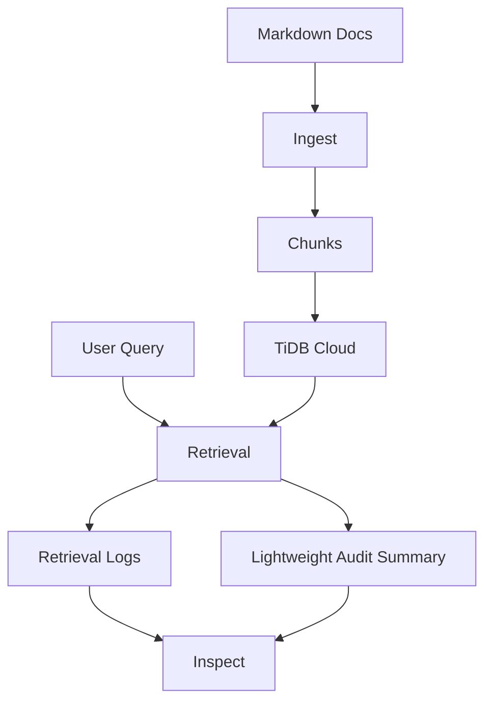

# Sayane TiDB Context Store Demo

A minimal TiDB Cloud backed Context Store demo linked to Sayane.

This repository is a reference implementation for the Zenn article **「RAGは検索して終わりではない：TiDB Cloudで作る監査可能なAIメモリ基盤」**.

It demonstrates how a RAG pipeline can be extended into an auditable AI memory workflow: Markdown ingestion, chunking, TiDB Cloud schema setup, lexical search, vector-like search, hybrid search, retrieval logging, and lightweight RDE-style audit summaries.

This is **not** the full Sayane implementation. It is a focused prototype for validating how Sayane Context Store concepts can be represented through a TiDB Cloud backend adapter.

## Repository status

This repository is a public demo prototype.

- License: Apache License 2.0
- Main target: TiDB Cloud backed Context Store demo
- Article target: Zenn technical article
- Scope: implementation boundary validation, not a production memory system
- Current maturity: small working sample with documented limitations

## What this demo shows

The demo focuses on the difference between ordinary RAG and auditable memory.

Ordinary RAG usually stops at:

```text
query -> retrieve -> generate
```

This demo explores the wider flow:

```text
query
  -> retrieve chunks
  -> record retrieval event
  -> assemble context
  -> generate or inspect response
  -> preserve candidate / audit summary
  -> inspect lineage later
```

In practical terms, the demo shows:

- Markdown document ingestion
- simple chunk registration
- TiDB Cloud schema initialization
- text search
- JSON-embedding based vector-like search
- hybrid search
- retrieval log storage
- retrieval inspection
- backend capability reporting
- lightweight RDE-style audit summaries

## Architecture



The repository intentionally keeps the architecture small. The purpose is to clarify the Context Store boundary before expanding toward a larger Sayane implementation.

## Current implementation boundary

The current vector mode is implemented as JSON embedding storage in TiDB plus Python-side cosine similarity.

It is **not yet TiDB-native vector-indexed search**.

That boundary is intentional. The article should not overclaim native TiDB vector-index execution until the implementation and benchmark path are verified. See:

- [`docs/article-implementation-notes.md`](docs/article-implementation-notes.md)
- [`docs/local-runbook.md`](docs/local-runbook.md)
- [`docs/demo-output.md`](docs/demo-output.md)

## Quick start

### 1. Install

```bash
python -m venv .venv
source .venv/bin/activate
python -m pip install -e .
```

Or:

```bash
make install
```

### 2. Configure environment

Copy the example environment file.

```bash
cp .env.example .env
```

Required for TiDB access:

```env
TIDB_HOST=
TIDB_PORT=4000
TIDB_USER=
TIDB_PASSWORD=
TIDB_DATABASE=sayane_context_demo
TIDB_SSL_CA=
```

Required only when using `--embed`, `--mode vector`, or `--mode hybrid`:

```env
OPENAI_API_KEY=
EMBEDDING_MODEL=text-embedding-3-small
EMBEDDING_DIM=1536
```

### 3. Inspect backend capabilities

This command does not require TiDB or OpenAI credentials.

```bash
sayane-tidb-demo capabilities
```

### 4. Initialize schema

```bash
sayane-tidb-demo init
# or
make init
```

### 5. Ingest sample Markdown documents

Without embeddings:

```bash
sayane-tidb-demo ingest data/sample_docs
# or
make ingest
```

With embeddings:

```bash
sayane-tidb-demo ingest data/sample_docs --embed
# or
make ingest-embed
```

### 6. Search

```bash
sayane-tidb-demo search "TiDB" --mode text
sayane-tidb-demo search "Context Store Interface" --mode vector
sayane-tidb-demo search "candidate lineage" --mode hybrid
```

Or:

```bash
make search-text
make search-vector
make search-hybrid
```

### 7. Inspect retrieval logs

```bash
sayane-tidb-demo logs
sayane-tidb-demo inspect <retrieval_id>
# or
make logs
```

## Expected article demo path

For the Zenn article, the recommended reproducible flow is:

```bash
sayane-tidb-demo capabilities
make init
make ingest
make search-text
make ingest-embed
make search-vector
make search-hybrid
make logs
```

Concrete captured outputs are maintained in [`docs/demo-output.md`](docs/demo-output.md).

## Documentation map

### Specifications

- [`docs/specs/open-context-store-interface.md`](docs/specs/open-context-store-interface.md): OCSI conceptual draft.
- [`docs/specs/ocsi-t-rde-requirement.md`](docs/specs/ocsi-t-rde-requirement.md): T-RDE compatibility requirement for OCSI implementations.
- [`docs/specs/ocsi-interface-minimality-principles.md`](docs/specs/ocsi-interface-minimality-principles.md): interface minimality principles.
- [`docs/specs/ocsi-compliance-checklist.md`](docs/specs/ocsi-compliance-checklist.md): practical conformance checklist.
- [`docs/specs/connection-layer-spec.md`](docs/specs/connection-layer-spec.md): Sayane-oriented connection layer profile.
- [`docs/specs/sayane-tidb-basic-spec.md`](docs/specs/sayane-tidb-basic-spec.md): TiDB adapter basic specification.

### Demo and article support

- [`docs/demo-scenario.md`](docs/demo-scenario.md): narrative scenario for the demo.
- [`docs/sayane-integration-demo-plan.md`](docs/sayane-integration-demo-plan.md): how this repository connects to Sayane concepts.
- [`docs/backend-selection-rationale.md`](docs/backend-selection-rationale.md): why the demo evaluates TiDB Cloud.
- [`docs/local-runbook.md`](docs/local-runbook.md): local setup and execution steps.
- [`docs/article-implementation-notes.md`](docs/article-implementation-notes.md): current implementation boundary and article claim scope.
- [`docs/demo-output.md`](docs/demo-output.md): concrete command output capture.
- [`docs/zenn-article-draft.md`](docs/zenn-article-draft.md): initial article draft.

### Engineering

- [`docs/engineering/rde-development-guidelines.md`](docs/engineering/rde-development-guidelines.md): lightweight RDE engineering policy for this demo.

## Why TiDB Cloud?

This demo does not treat a generic vector database as the default answer.

The working hypothesis is that auditable AI memory needs more than nearest-neighbor search. It needs relational metadata, retrieval events, context assembly records, candidate states, and later inspection. TiDB Cloud is evaluated here because it can serve as a SQL-oriented backend while still supporting the direction of vector and hybrid retrieval.

The current implementation is intentionally conservative. It first validates the Context Store interface and audit-log shape, then leaves native vector-index optimization as a later step.

## Relation to Sayane

Sayane treats captured context as a candidate before it becomes canonical memory.

That means generated content should not automatically become durable context. It should be logged, inspected, reviewed, and only then accepted, revised, rejected, or kept pending.

This demo models a small part of that idea:

- retrieval logs preserve what was searched;
- backend capabilities clarify what the store can and cannot do;
- audit summaries record lightweight meaning-change notes;
- documentation separates implemented behavior from article claims.

## License

Apache License 2.0.

See [`LICENSE`](LICENSE).
